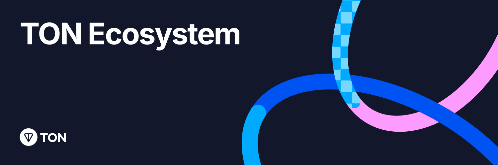

## A collection of live projects within the TON Ecosystem

- [Project Categories](#project-categories)
  - [Forums](#forums)
  - [Bridges](#bridges)
  - [DeFi](#defi)
    - [Decentralized Exchanges](#decentralized-exchanges)
    - [Decentralized Exchanges for wTON](#decentralized-exchanges-for-wton)
    - [Lending and Borrowing](#lending-and-borrowing)
    - [Staking](#staking)
    - [Stablecoins](#stablecoins)
  - [Launchpad](#launchpad)
  - [Centralized Exchanges](#centralized-exchanges)
  - [On-Ramp](#on-ramp)
  - [Explorers](#explorers)
  - [Games](#games)
  - [Infra](#infra)
    - [Web3 Internet](#web3-internet)
    - [DeFi](#defi-1)
    - [Portfolio tracker](#portfolio-tracker)
    - [Gaming](#gaming)
    - [Storage](#storage)
    - [Integrated Development Environment (IDE)](#integrated-development-environment-ide)
    - [Dev Tools](#dev-tools)
    - [Nodes](#nodes)
    - [Event tracker](#event-tracker)
    - [Oracles](#oracles)
    - [Zk on TON](#zk-on-ton)
    - [Security Solutions](#security-solutions)
  - [Education](#education)
  - [YouTube Tutorials](#youtube-tutorials)
- [Shopping](#shopping)
  - [TON Payments](#ton-payments)
  - [Marketplaces](#marketplaces)
- [NFT](#nft)
  - [NFT Services](#nft-services)
  - [NFT Tooling](#nft-tooling)
  - [Telegram Mini Apps Tooling](#telegram-mini-apps-tooling)
  - [Compliance](#compliance)
  - [Analytics](#analytics)
  - [API Providers](#api-providers)
  - [Payments](#payments)
  - [App Store](#app-store)
  - [SocialFi](#socialfi)
  - [Wallets](#wallets)
  - [Auth Protocols](#auth-protocols)
    - [Non-Custodial Wallets](#non-custodial-wallets)
    - [Custodial Wallets](#custodial-wallets)
    - [Multisig Wallets](#multisig-wallets)
    - [Hardware Wallets](#hardware-wallets)
  - [VPN](#vpn)
  - [Gambling and Skill-based games](#gambling-and-skill-based-games)
  - [Memecoins](#memecoins)
    - [Disclaimer for Jetton Inclusion Criteria](#disclaimer-for-jetton-inclusion-criteria)
  - [Inscriptions](#inscriptions)
  - [POW](#pow)
- [Disclaimer](#disclaimer)
- [Contribution Guidelines](#contribution-guidelines)
  - [Updating Your PR](#updating-your-pr)

---

# Project Categories

## Forums

| Name           | Telegram                              | GitHub | Twitter                                     | Website                                                   |
| -------------- | ------------------------------------- | ------ | ------------------------------------------- | --------------------------------------------------------- |
| Ton Research   | [Telegram](https://t.me/tonresear_ch) |        | [Twitter](https://twitter.com/ton_research) | [Website](https://tonresear.ch)                           |
| TON Overflow   |                                       |        |                                             | [Website](https://answers.ton.org)                        |
| Stack Overflow |                                       |        |                                             | [Website](https://stackoverflow.com/questions/tagged/ton) |

## Bridges

| Name           | Telegram                                  | GitHub                                                  | Twitter                                       | Website                                  |
| -------------- | ----------------------------------------- | ------------------------------------------------------- | --------------------------------------------- | ---------------------------------------- |
| TON Bridge     | [Telegram](https://t.me/toncoin)          | [GitHub](https://github.com/ton-blockchain/bridge-func) | [Twitter](https://twitter.com/ton_blockchain) | [Website](https://bridge.ton.org/)       |
| Orbit Bridge   | [Telegram](https://t.me/Orbit_Chain)      | [GitHub](https://github.com/orbit-chain)                | [Twitter](https://twitter.com/Orbit_Chain)    | [Website](https://bridge.orbitchain.io/) |
| XP.Network     | [Telegram](https://t.me/xp_network)       | [GitHub](https://github.com/XP-NETWORK)                 | [Twitter](https://twitter.com/xpnetwork_)     | [Website](https://bridge.xp.network/)    |
| TonTake Bridge | [Telegram](https://t.me/tontakebridgebot) |                                                         |                                               |                                          |
| Wallet Bridge  | [Telegram](https://t.me/walletbridgebot)  |                                                         |                                               |                                          |
| Layerswap      |                                           | [GitHub](https://github.com/layerswap/layerswapapp)     | [Twitter](https://twitter.com/layerswap)      | [Website](https://www.layerswap.io/)     |

## DeFi

### Decentralized Exchanges

| Name            | Telegram                                       | GitHub                                   | Twitter                                        | Website                                          |
| --------------- | ---------------------------------------------- | ---------------------------------------- | ---------------------------------------------- | ------------------------------------------------ |
| DeDust.io       | [Telegram](https://t.me/dedust)                | [GitHub](https://github.com/dedust-io)   | [Twitter](https://twitter.com/dedust_io)       | [Website](https://dedust.io/swap)                |
| ION Finance     | [Telegram](https://t.me/IONFINANCE_OFFICIAL)   | [GitHub](https://github.com/ion-finance) | [Twitter](https://twitter.com/Ion_Finance)     | [Website](https://ionfi.xyz/)                    |
| Megaton Finance | [Telegram](https://t.me/MegatonFinanceChannel) | [GitHub](https://github.com/megaton-fi)  | [Twitter](https://twitter.com/@Megaton_Fi)     | [Website](https://megaton.fi/)                   |
| Rainbow Swap    | [Telegram](https://t.me/rainbow_swap)            | [GitHub](https://github.com/0xblackbot/rainbow-swap)  | [Twitter](https://x.com/rainbow_swap)      | [Website](https://rainbow.ag/)                   |
| Ston.fi         | [Telegram](https://t.me/stonfidex)             | [GitHub](https://github.com/ston-fi)     | [Twitter](https://twitter.com/ston_fi)         | [Website](https://ston.fi/)                      |
| Storm           | [Telegram](https://t.me/storm_trade_fam)       |                                          | [Twitter](https://twitter.com/storm_trade_ton) | [Website](https://stormtrade.dev/trade/TON_USDT) |
| Tradoor.io      | [Telegram](https://t.me/tradoor_io)            | [GitHub](https://github.com/TonTradoor)  | [Twitter](https://twitter.com/tradoor_io)      | [Website](https://tradoor.io/)                   |
| Torch Finance   | [Telegram](https://t.me/oxcurdle)              | [GitHub](https://github.com/torch-core)  | [Twitter](https://x.com/TorchTon)              | [Website](https://torch.finance/)                |
| TON Hedge       | [Telegram](https://t.me/ton_hedge)             |                                          | [Twitter](https://twitter.com/tonhedge)        |                                                  |
| TONCO           | [Telegram](https://t.me/tonco_io)	             | [GitHub](https://github.com/cryptoalgebra/tonco-demo)  | [Twitter](https://x.com/Tonco_io)| [Website](https://tonco.io/)                     |

### Decentralized Exchanges for wTON

| Name        | Telegram                                 | GitHub                                   | Twitter                                    | Website                                                                                               |
| ----------- | ---------------------------------------- | ---------------------------------------- | ------------------------------------------ | ----------------------------------------------------------------------------------------------------- |
| Dodo        | [Telegram](https://t.me/dodoex_official) | [GitHub](https://github.com/DODOEX)      | [Twitter](https://twitter.com/BreederDodo) | [Website](https://app.dodoex.io/swap/network/mainnet/ton/USDC)                                        |
| Uniswap     |                                          | [GitHub](https://github.com/Uniswap)     | [Twitter](https://twitter.com/uniswap)     | [Website](https://app.uniswap.org/swap?outputcurrency=0x582d872a1b094fc48f5de31d3b73f2d9be47def1)     |
| PancakeSwap | [Telegram](https://t.me/pancakeswap)     | [GitHub](https://github.com/pancakeswap) | [Twitter](https://twitter.com/pancakeswap) | [Website](https://pancakeswap.finance/swap?outputcurrency=0x76a797a59ba2c17726896976b7b3747bfd1d220f) |
| Nomiswap    | [Telegram](https://t.me/nominex_news_ru) | [GitHub](https://github.com/nominex)     | [Twitter](https://twitter.com/Nomiswap)    | [Website](https://nomiswap.io/swap?outputCurrency=0x76A797A59Ba2C17726896976B7B3747BfD1d220f)         |

### Lending and Borrowing

| Name          | Telegram | GitHub                              | Twitter                                     | Website                              |
| ------------- | -------- | ----------------------------------- | ------------------------------------------- | ------------------------------------ |
| Evaa Protocol |          | [GitHub](https://github.com/evaafi) | [Twitter](https://twitter.com/evaaprotocol) | [Website](https://app.evaa.finance/) |

### Staking

| Name              | Telegram                                    | GitHub                                   | Twitter                                     | Website                                 |
| ----------------- | ------------------------------------------- | ---------------------------------------- | ------------------------------------------- | --------------------------------------- |
| TON Whales        | [Telegram](https://t.me/WhalesSupportBot)   | [GitHub](https://github.com/tonwhales)   | [Twitter](https://twitter.com/whalescorp)   | [Website](https://tonwhales.com/)       |
| TON Validators    | [Telegram](https://t.me/ton_validators_bot) |                                          |                                             | [Website](https://tonvalidators.org/)   |
| TON Stake         | [Telegram](https://t.me/tonstake_en)        |                                          | [Twitter](https://twitter.com/tonstakecom)  | [Website](https://www.tonstake.com/#/)  |
| TON Raffles       | [Telegram](https://t.me/tonraffles)         |                                          | [Twitter](https://x.com/TonRaffles)         | [Website](https://tonraffles.app)       |
| Hipo Finance      | [Telegram](https://t.me/hipo_chat)          | [GitHub](https://github.com/HipoFinance) | [Twitter](https://twitter.com/hipofinance)  | [Website](https://app.hipo.finance/)    |
| TON Stake Lottery | [Telegram](https://t.me/tonstakelottery)    |                                          |                                             | [Website](https://tonstakelottery.com/) |
| Bemo Finance      | [Telegram](https://t.me/bemofinance)        |                                          | [Twitter](https://twitter.com/bemo_finance) | [Website](https://www.bemo.finance/)    |
| Tonstakers        | [Telegram](https://t.me/thetonstakers)      |                                          | [Twitter](https://twitter.com/tonstakers)   | [Website](https://tonstakers.com/)      |
| Stakee            | [Telegram](https://t.me/stakee)             |                                          |                                             | [Website](https://t.me/StakeeBot/start) |
| JVault            | [Telegram](https://t.me/JVault)             | [GitHub](https://github.com/JVault-app)  |                                             | [Website](https://jvault.app)           |

### Stablecoins

| Name          | Telegram                                 | GitHub | Twitter                                        | Website                              |
| ------------- | ---------------------------------------- | ------ | ---------------------------------------------- | ------------------------------------ |
| Aqua Protocol | [Telegram](https://t.me/aquaprotocolxyz) |        | [Twitter](https://twitter.com/aquaprotocolxyz) | [Website](https://aquaprotocol.xyz/) |

## Launchpad

| Name              | Telegram                                        | GitHub | Twitter                                      | Website                                 |
| ----------------- | ----------------------------------------------- | ------ | -------------------------------------------- | --------------------------------------- |
| Tonstarter        | [Telegram](https://t.me/+RH50YeWT6Ps3ODUy)      |        | [Twitter](https://twitter.com/ton_starter)   | [Website](https://tonstarter.com/)      |
| TON Gagarin World | [Telegram](https://t.me/Ton_Gagarin_World_Chat) |        | [Twitter](https://twitter.com/GAGARIN_World) | [Website](https://ton.gagarin.world/)   |
| TonUP             | [Telegram](https://t.me/TonUP_io)               |        | [Twitter](https://twitter.com/TonUP_io)      | [Website](https://tonup.io/launchpad/)  |
| JVault            | [Telegram](https://t.me/JVault)                 |        | [Twitter](https://twitter.com/JVault_app)    | [Website](https://jvault.xyz/)          |
| GasPump           | [Telegram](https://t.me/gaspump)                |        | [Twitter](https://x.com/gaspump_tv)          | [Website](https://t.me/gasPump_bot)     |
| Wonton.fun        | [Telegram](https://t.me/wontondotfun)           |        | [Twitter](https://x.com/wontondotfun)        | [Website](https://t.me/wontondotfun_bot)|
| Pumpers.tg        | [Telegram](https://t.me/pumpers)                |        | [Twitter](https://x.com/pumperstg)           | [Website](https://t.me/PumpersTGBot)    |
| TonPump.app       | [Telegram](https://t.me/tonpump_community)      |        | [Twitter](https://x.com/TonPump_app)         | [Website](https://t.me/tonpumpapp_bot)  |
| PizzaTon          | [Telegram](https://t.me/pitzaton)               |        | [Twitter](https://x.com/pitzaton)            | [Website](https://launch.pizzaton.me)   |

## Centralized Exchanges

| Name    | Telegram                                     | GitHub | Twitter                                      | Website                              |
| ------- | -------------------------------------------- | ------ | -------------------------------------------- | ------------------------------------ |
| OKX     | [Telegram](https://t.me/OKXOfficial_English) |        | [Twitter](https://twitter.com/okx)           | [Website](https://www.okx.com/)      |
| MEXC    | [Telegram](https://t.me/MEXCEnglish)         |        | [Twitter](https://twitter.com/MEXC_Official) | [Website](https://www.mexc.com/)     |
| KuCoin  | [Telegram](https://t.me/Kucoin_Exchange)     |        | [Twitter](https://x.com/kucoincom)           | [Website](https://www.kucoin.com)    |
| HTX     | [Telegram](https://t.me/htxglobalofficial)   |        | [Twitter](https://twitter.com/HTX_Global)    | [Website](https://www.htx.com/)      |
| Bybit   | [Telegram](https://t.me/BybitEnglish)        |        | [Twitter](https://x.com/Bybit_Official)      | [Website](https://www.bybit.com/en/) |
| Gate.io | [Telegram](https://t.me/BybitEnglish)        |        | [Twitter](https://x.com/gate_io)             | [Website](https://www.gate.io)       |
| xRocket | [Telegram](https://t.me/xrocket)             |        | [Twitter](https://x.com/xRocket_tg)          | [Website](https://xrocket.tg/en)     |

## On-Ramp

| Name         | Telegram                                   | GitHub                                    | Twitter                                       | Website                                                        |
| ------------ | ------------------------------------------ | ----------------------------------------- | --------------------------------------------- | -------------------------------------------------------------- |
| Onmeta | [Telegram](https://t.me/onmetatg)      |   [GitHub](https://github.com/onmetahq)   | [Twitter](https://x.com/onmetahq)  | [Website](https://onmeta.in/Buy) |
| Mercuryo     | [Telegram](https://telegram.me/HRMercuryo) |                                           | [Twitter](https://twitter.com/Mercuryo_io)    | [Website](https://mercuryo.io/)                                |
| NEOCRYPTO    |                                            |                                           |                                               | [Website](https://neocrypto.net/)                              |
| Guardarian   |                                            |                                           | [Twitter](https://twitter.com/Guardarian_com) | [Website](https://guardarian.com/buy-ton)                      |
| Bit2Me       | [Telegram](https://t.me/Bit2Me_ES)         | [GitHub](https://github.com/bit2me-devs)  | [Twitter](https://twitter.com/Bit2Me_Global)  | [Website](https://bit2me.com/buy-ton)                          |
| MoonPay      |                                            | [GitHub](https://github.com/moonpay)      | [Twitter](https://twitter.com/moonpay)        | [Website](https://www.moonpay.com/buy)                         |
| OnRamp.money | [Telegram](https://t.me/onramp_money)      |                                           | [Twitter](https://twitter.com/onrampmoney)    | [Website](https://onramp.money/main/buy/?appId=1&coinCode=ton) |
| FinchPay     | [Telegram](https://t.me/FinchPay_io)       |                                           | [Twitter](https://twitter.com/FinchPay_io)    | [Website](https://finchpay.io/)                                |
| Alchemy Pay  | [Telegram](https://t.me/alchemy_official)  |                                           | [Twitter](https://twitter.com/alchemypay)     | [Website](https://alchemypay.org/)                             |
| Itez         |                                            |                                           | [Twitter](https://twitter.com/Itezofficial)   | [Website](https://itez.com/)                                   |
| ChangeNOW    | [Telegram](https://t.me/changeNOW_chat)    | [GitHub](https://github.com/ChangeNow-io) | [Twitter](https://twitter.com/ChangeNOW_io)   | [Website](https://changenow.io/?from=usdterc20&to=ton)         |
| Transack     | [Telegram](https://t.me/transakfinance)    | [GitHub](https://github.com/Transak)      | [Twitter](https://twitter.com/transak)        | [Website](https://global.transak.com/)                         |
| Changelly    | [Telegram](https://t.me/changelly)         | [GitHub](https://github.com/changelly)    | [Twitter](https://twitter.com/changelly_team) | [Website](https://changelly.com/)                              |

## Explorers

| Name               | Telegram                                          | GitHub                                            | Twitter                                       | Website                                                         |
| ------------------ | ------------------------------------------------- | ------------------------------------------------- | --------------------------------------------- | --------------------------------------------------------------- |
| DYOR               | [Telegram](https://t.me/addlist/ykImgvSTJkY1YTli) |                                                   | [Twitter](https://twitter.com/dyorninja)      | [Website](https://dyor.io)                                      |
| Tonscan by Bastion |                                                   |                                                   |                                               | [Website](https://tonscan.com/)                                 |
| Tonscan            |                                                   | [GitHub](https://github.com/catchain/tonscan)     |                                               | [Website](https://tonscan.org/)                                 |
| Tonviewer          |                                                   |                                                   | [Twitter](https://twitter.com/tonappshq)      | [Website](https://tonviewer.com/)                               |
| TONAPI             | [Telegram](https://t.me/tonkeeper)                | [GitHub](https://github.com/tonkeeper/opentonapi) | [Twitter](https://twitter.com/tonappshq)      | [Website](https://tonapi.io/)                                   |
| Whales Explorer    |                                                   | [GitHub](https://github.com/tonwhales)            | [Twitter](https://twitter.com/whalescorp)     | [Website](https://tonwhales.com/explorer)                       |
| M3TA               | [Telegram](https://t.me/M3TA_Analytics)           |                                                   | [Twitter](https://twitter.com/M3TA_Analytics) | [Website](https://m3talab.io/reports/ton-telegram-open-network) |
| TON NFT Explorer   | [Telegram](https://t.me/this_is_TON)              |                                                   |                                               | [Website](https://explorer.tonnft.tools/)                       |
| DTON               | [Telegram](https://t.me/disintar)                 |                                                   | [Twitter](https://twitter.com/disintar_io/)   | [Website](https://dton.io/)                                     |
| 3xpl               |                                                   | [GitHub](https://github.com/3xplcom)              | [Twitter](https://twitter.com/3xplcom)        | [Website](https://3xpl.com/ton)                                 |
| TON.sh             |                                                   |                                                   |                                               | [Website](https://ton.sh/)                                      |
| Tenere Explorer    | [Telegram](https://t.me/teneretoken)              |                                                   |                                               | [Website](https://www.teneretoken.com/tenere-explorer)          |
| NFTScan            |                                                   | [Github](https://github.com/nftscan-official)     | [Twitter](https://twitter.com/nftscan_com)    | [Website](https://ton.nftscan.com/)                             |

## Games

| Name                    | Telegram                                        | GitHub                                                       | Twitter                                       | Website                                        |
| ----------------------- | ----------------------------------------------- | ------------------------------------------------------------ | --------------------------------------------- | ---------------------------------------------- |
| Tonarchy                | [Telegram](https://t.me/Tonarchy)               |                                                              | [Twitter](https://twitter.com/tonarchy)       | [Website](https://tonarchy.online/)            |
| TON Planets Mars        | [Telegram](https://t.me/TONPlanets)             |                                                              | [Twitter](https://twitter.com/TonPlanets)     | [Website](https://mars.tonplanets.com/en/)     |
| TON Walk | [Telegram](https://t.me/tonwalk_news) | [GitHub](https://github.com/tonwalk) | [Twitter](https://x.com/tonwalk_app) | [Website](https://tonwalk.com)
| PlayDeck                | [Telegram](https://t.me/playdeckbot)            | [GitHub](https://github.com/ton-play)                        | [Twitter](https://twitter.com/insider_ton)    | [Website](https://tonplay.io/games/DZmrVk1mJ5) |
| Lifeblood               |                                                 |                                                              |                                               | [Website](https://lifeblood.ru/)               |
| Tonrare                 | [Telegram](https://t.me/tonrare_games)          |                                                              |                                               | [Website](https://tonrare.com/explore)         |
| Stepogram               |                                                 |                                                              | [Twitter](https://twitter.com/stepogram)      | [Website](https://stepogram.com/)              |
| PunkCity                | [Telegram](https://t.me/PunkCity2094bot)        | [GitHub](https://github.com/TON-Punks/punk-city-hack-a-tonx) | [Twitter](https://twitter.com/TonPunks)       |                                                |
| Tongochi Game           | [Telegram](https://t.me/TonGochi_bot)           | [GitHub](https://github.com/tongochi/DEX)                    | [Twitter](https://twitter.com/tongochi)       |                                                |
| Toncaps                 | [Telegram](https://t.me/toncapsio)              |                                                              |                                               | [Website](https://toncaps.io/)                 |
| Fanton                  | [Telegram](https://t.me/fantongamebot)          |                                                              | [Twitter](https://twitter.com/FantasyFanton)  | [Website](https://fan-ton.com/)                |
| BIOM Play2Earn          | [Telegram](https://t.me/Biom_play2earn_bot)     |                                                              |                                               |                                                |
| Zernosklad              | [Telegram](https://t.me/TonTake)                |                                                              | [Twitter](https://twitter.com/TonTakeGame)    | [Website](https://zernosklad.com/)             |
| TON Chess               | [Telegram](https://tonplay.io/games/RDKcT26bNo) | [GitHub](https://github.com/ton-play)                        | [Twitter](https://twitter.com/insider_ton)    | [Website](https://tonplay.io/games/RDKcT26bNo) |
| Instant Games           | [Telegram](https://t.me/InstantGames_bot)       |                                                              |                                               | [Website](https://8xr.io/)                     |
| Tonlanders              | [Telegram](https://t.me/tonlanders)             |                                                              |                                               |                                                |
| Escape from Zeya        | [Telegram](https://t.me/tonplayinsider)         | [Twitter](https://twitter.com/insider_ton)                   |                                               | [Website](https://tonplay.io/games/DZmrVk1mJ5) |
| Batte Planes            | [Telegram](https://t.me/battleplanes)           |                                                              |                                               |                                                |
| Fanton Fantasy Football | [Telegram](https://t.me/FanTonGameBot)          |                                                              |                                               |                                                |
| Tongochi Game           | [Telegram](https://t.me/TonGochi_bot)           |                                                              |                                               |                                                |
| CockFights Game         | [Telegram](https://t.me/TonCocks)               |                                                              | [Twitter](https://twitter.com/Cock_Fights)    | [Website](https://cock-fights.com)             |
| Chess Zombies           | [Telegram](https://t.me/chesszombieseng)        | [GitHub](https://github.com/SHEDEVERstudio)                  | [Twitter](https://twitter.com/ShedEVERstudio) | [Website](https://chesszombies.fun)            |
| Gatto Game              | [Telegram](https://t.me/gatto_gamebot)          |                                                              | [Twitter](https://x.com/Gatto_game)           |                                                |
| Ton Potato              | [Telegram](https://t.me/ton_potato_bot)         |                                                              | [Twitter](https://twitter.com/TonPotato)      | [Website](https://clck.ru/3AQPSo)              |
| Totemancer              | [Telegram](https://t.me/TotemancerBot)          | [GitHub](https://github.com/Totemancer)                      | [Twitter](https://x.com/Totemancer)           | [Website](https://totemancer.com)              |
| TomTalk                 | [Telegram](https://t.me/TOMTALK_BOT)            | [GitHub](https://github.com/tomtalkofficial)                        | [Twitter](https://x.com/Tomtalkofficial)    | [Website](https://tomtalk.io/)
| Partona.AI              | [Telegram](https://t.me/partona_bot)            |                                                              | [Twitter](https://x.com/partona_ai)           | [Website](https://partona.ai)                  |
| Dungeon of KITSU        | [Telegram](https://t.me/DungeonsOfKitsune_bot/game) |                                                          | [Twitter](https://x.com/kitsuneton)           |                                                |

## Infra

### Web3 Internet

| Name              | Telegram                               | GitHub                                                      | Twitter                                        | Website                                                                                         |
| ----------------- | -------------------------------------- | ----------------------------------------------------------- | ---------------------------------------------- | ----------------------------------------------------------------------------------------------- |
| Tonkeeper         | [Telegram](https://t.me/tonkeeper)     | [GitHub](https://github.com/tonkeeper/wallet-api)           | [Twitter](https://twitter.com/tonkeeper)       | [Website](https://tonkeeper.com/)                                                               |
| MyTonWallet       | [Telegram](https://t.me/MyTonWalletEn) | [GitHub](https://github.com/mytonwalletorg/mytonwallet)     |                                                | [Website](https://mytonwallet.io/)                                                              |
| OpenMask          | [Telegram](https://t.me/openproduct)   | [GitHub](https://github.com/OpenProduct/openmask-extension) | [Twitter](https://twitter.com/openmask_wallet) | [Website](https://www.openmask.app/)                                                            |
| TON Search Engine | [Telegram](https://t.me/runner_ton)    |                                                             | [Twitter](https://twitter.com/TonxStudio)      | [Website](https://ton.run/)                                                                     |
| TON Proxy         |                                        | [GitHub](https://github.com/tonwhales/ton-proxy)            | [Twitter](https://twitter.com/whalescorp)      | [Website](https://chrome.google.com/webstore/detail/ton-proxy/pmgpnamlibffaaigdcohddlnokolfgnc) |
| TON DNS           | [Telegram](https://t.me/toncoin)       | [GitHub](https://github.com/ton-blockchain)                 | [Twitter](https://twitter.com/ton_blockchain)  | [Website](https://dns.ton.org/)                                                                 |

### DeFi

| Name       | Telegram                                   | GitHub                                                      | Twitter                                       | Website                            |
| ---------- | ------------------------------------------ | ----------------------------------------------------------- | --------------------------------------------- | ---------------------------------- |
| TON Minter | [Telegram](https://t.me/+YDnoBue1Dz81ZTMy) | [GitHub](https://github.com/ton-blockchain/minter-contract) | [Twitter](https://twitter.com/ton_blockchain) | [Website](https://minter.ton.org/) |
| TON Locker |                                            | [GitHub](https://github.com/ton-blockchain/locker-contract) |                                               |                                    |
| CRYPTON    | [Telegram](https://t.me/cryptonportal)     |                                                             | [Twitter](https://twitter.com/thetonhub)      | [Website](https://crypton.tools)   |
| TON MULTISENDER | [Telegram](https://t.me/MultiSender)  |                                                             | [Twitter](https://twitter.com/multi_sender)   | [Website](https://ton.multisender.app) |
| TON Bulksender | [Telegram](https://t.me/bulksender)  |                                                             | [Twitter](https://twitter.com/TokenBulksender)   | [Website](https://ton.bulksender.app) |
| sTONks     | [Telegram](https://t.me/stonksonton)	      |                                                             | [Twitter](https://x.com/tonstonks)            | [Website](https://stonksbots.com)  |

### Portfolio tracker

| Name        | Telegram                             | GitHub | Twitter | Website                            |
| ----------- | ------------------------------------ | ------ | ------- | ---------------------------------- |
| TractionEye | [Telegram](https://t.me/TractionEye) |        |    [Twitter](https://x.com/TractionEye)     | |
| Portfel | [Telegram](https://t.me/portfel) |   [GitHub](https://github.com/portfel-ton)     |    [Twitter](https://x.com/PortfelTon)     | [Website](https://portfel.me)|

### Gaming

| Name         | Telegram                                | GitHub                                | Twitter                                    | Website                         |
| ------------ | --------------------------------------- | ------------------------------------- | ------------------------------------------ | ------------------------------- |
| TON Play     | [Telegram](https://t.me/tonplayinsider) | [GitHub](https://github.com/ton-play) | [Twitter](https://twitter.com/insider_ton) | [Website](https://tonplay.io)   |
| 8XR          | [Telegram](https://t.me/gam8s)          |                                       | [Twitter](https://twitter.com/8xr_engine)  | [Website](https://8xr.io/)      |
| Cosmoton.xyz |                                         |                                       |                                            | [Website](https://cosmoton.xyz) |
| PaperPlane | [Telegram](https://t.me/PaperPlaneGameBot) | [GitHub](https://github.com/paperplaneonton) | [Twitter](https://twitter.com/paperplane_ton) | [Website](https://paperplanetoken.site) |
| TON SHIP     | [Telegram](https://t.me/TonShipCom)     | [GitHub](https://github.com/TonShipCom) | [Twitter](https://twitter.com/TonShipCom)  | [Website](https://tonship.com)  |
| TON Map     | [Telegram](https://t.me/tonmap)     | [GitHub](https://github.com/OtherVerse) | [Twitter](https://twitter.com/thetonmap)  | [Website](https://tonmap.app)  |

### Storage

| Name              | Telegram                              | GitHub                                                | Twitter                                   | Website                         |
| ----------------- | ------------------------------------- | ----------------------------------------------------- | ----------------------------------------- | ------------------------------- |
| Tonbyte           | [Telegram](https://t.me/tonbytecom)   | [GitHub](https://github.com/tonbyte)                  | [Twitter](https://twitter.com/TON_Byte)   | [Website](https://tonbyte.com/) |
| TON Torrents      | [Telegram](https://t.me/tonrh)        | [GitHub](https://github.com/xssnick/TON-Torrent)      |                                           |                                 |
| TON Utils Storage | [Telegram](https://t.me/tonrh)        | [GitHub](https://github.com/xssnick/tonutils-storage) |                                           |                                 |
| Ton.ski           | [Telegram](https://t.me/searchington) | [GitHub](https://gitea.ennucore.com/agorata)          | [Twitter](https://twitter.com/tonski_ton) | [Website](https://ton.ski/)     |

### Integrated Development Environment (IDE)

| Name                       | Telegram                          | GitHub                                                         | Twitter                                 | Website                                                                                |
| -------------------------- | --------------------------------- | -------------------------------------------------------------- | --------------------------------------- | -------------------------------------------------------------------------------------- |
| TON IntelliJ Plugin        |                                   | [GitHub](https://github.com/ton-blockchain/intellij-ton)       |                                         | [Website](https://plugins.jetbrains.com/plugin/18541-ton)                              |
| TON VS Code Plugin         |                                   | [GitHub](https://github.com/ton-foundation/vscode-func)        |                                         | [Website](https://marketplace.visualstudio.com/items?itemName=tonwhales.func-vscode)   |
| Tact VS Code Plugin        |                                   | [GitHub](https://github.com/tact-lang/tact-vscode)             |                                         | [Website](https://marketplace.visualstudio.com/items?itemName=KonVik.tact-lang-vscode) |
| Neovim Plugin              |                                   | [GitHub](https://github.com/cryshado/neovim-ton-dev)           |                                         |
| Sublime Text Editor Plugin |                                   | [GitHub](https://github.com/savva425/func_plugin_sublimetext3) |                                         |
| Nujan IDE                  | [Telegram](https://t.me/Nujan_io) | [GitHub](https://github.com/nujan-io/nujan-ide)                | [Twitter](https://twitter.com/nujan_io) | [Website](https://nujan.io/)                                                           |

### Dev Tools

| Name                 | Telegram                             | GitHub                                                        | Twitter                                  | Website                                                                                        |
| -------------------- | ------------------------------------ | ------------------------------------------------------------- | ---------------------------------------- | ---------------------------------------------------------------------------------------------- |
| IntelliJ Idea plugin |                                      | [GitHub](https://github.com/ton-blockchain/intellij-ton)      |                                          | [Website](https://plugins.jetbrains.com/plugin/18541-ton)                                      |
| Tonana               | [Telegram](https://t.me/tonanadao)   | [GitHub](https://github.com/tonanadao)                        | [Twitter](https://twitter.com/Tonanadao) | [Website](https://tonana.org)                                                                  |
| WebDeployer          |                                      | [GitHub](https://github.com/ProgramCrafter/ton-qr-deployer)   |                                          | [Website](https://ratingers.pythonanywhere.com/deployer/)                                      |
| TON Verifier         | [Telegram](https://t.me/tonverifier) | [GitHub](https://github.com/ton-blockchain/verifier)          |                                          | [Website](https://verifier.ton.org)                                                            |
| TON Timer            |                                      | [GitHub](https://github.com/ProgramCrafter/ton-stable-timer/) |                                          | [Website](https://programcrafter.github.io/ton-stable-timer)                                   |
| Rift                 |                                      |                                                               |                                          | [Website](https://rift.skyring.io)                                                             |
| TON NoCode SDK       |                                      |                                                               |                                          | [Website](https://novabloq.com/plugin/ton-connect-nocode-sdk-1679505489636x562684572799117440) |

### Nodes

| Name      | Telegram | GitHub                                                | Twitter | Website                          |
| --------- | -------- | ----------------------------------------------------- | ------- | -------------------------------- |
| TON Admin |          |                                                       |         | [Website](https://tonadmin.org/) |
| MyTonCtrl |          | [GitHub](https://github.com/ton-blockchain/mytonctrl) |         |

### Event tracker

| Name        | Telegram                             | GitHub | Twitter | Website                            |
| ----------- | ------------------------------------ | ------ | ------- | ---------------------------------- |
| Xtontracker | [Telegram](https://t.me/xtontracker) |        |         | [Website](https://xtontracker.com) |

### Oracles

| Name            | Telegram                                 | GitHub                                        | Twitter                                      | Website                              |
| --------------- | ---------------------------------------- | --------------------------------------------- | -------------------------------------------- | ------------------------------------ |
| Redstone Oracle | [Telegram](https://t.me/redstonefinance) | [GitHub](https://github.com/redstone-finance) | [Twitter](https://twitter.com/redstone_defi) | [Website](https://redstone.finance/) |

### Zk on TON

| Name           | Telegram                           | GitHub                                                    | Twitter                                       | Website                                                                  |
| -------------- | ---------------------------------- | --------------------------------------------------------- | --------------------------------------------- | ------------------------------------------------------------------------ |
| ZK on TON      |                                    |                                                           |                                               | [Website](https://docs.ton.org/develop/dapps/tutorials/simple-zk-on-ton) |
| Tonnel Network | [Telegram](https://t.me/tonnel_en) | [GitHub](https://github.com/SaberDoTcodeR/Tonnel-Network) | [Twitter](https://twitter.com/tonnel_network) | [Website](https://www.tonnel.network/)                                   |

### Security Solutions

| Name          | Telegram                                      | GitHub                                     | Twitter                                       | Website                                                     |
| ------------- | --------------------------------------------- | ------------------------------------------ | --------------------------------------------- | ----------------------------------------------------------- |
| CertiK        | [Telegram](https://t.me/CertiKCommunity)      | [GitHub](https://github.com/CertiKProject) | [Twitter](https://twitter.com/CertiK)         | [Website](https://www.certik.com/)                          |
| Trail of Bits |                                               | [GitHub](https://github.com/trailofbits)   | [Twitter](https://twitter.com/trailofbits)    | [Website](https://www.trailofbits.com/)                     |
| Hacken        | [Telegram](https://t.me/hackenai)             | [GitHub](https://github.com/hknio)         | [Twitter](https://twitter.com/hackenclub)     | [WebSite](https://hacken.io/)                               |
| HackenProof   | [Telegram](https://t.me/hackenproof)          | [GitHub](https://github.com/hackenproof)   | [Twitter](https://twitter.com/HackenProof)    | [WebSite](https://hackenproof.com/)                         |
| Hexens.io     |                                               | [GitHub](https://github.com/Hexens)        | [Twitter](https://twitter.com/hexensio)       | [Website](https://hexens.io/)                               |
| Quantstamp    |                                               | [GitHub](https://github.com/quantstamp)    | [Twitter](https://twitter.com/Quantstamp)     | [Website](https://quantstamp.com/)                          |
| ScaleBit      |                                               | [GitHub](https://github.com/ScaleBit)      | [Twitter](https://twitter.com/scalebit_)      | [Website](https://www.scalebit.xyz/)                        |
| QuillAudits   | [Telegram](https://t.me/quillaudits_official) | [GitHub](https://github.com/Quillhash)     | [Twitter](https://twitter.com/QuillAudits_ai) | [Website](https://www.quillaudits.com/smart-contract-audit) |
| PositiveWeb3   | [Telegram](https://t.me/PositiveWeb3) | [GitHub](https://github.com/PositiveSecurity)     | [Twitter](https://twitter.com/PositiveWeb3) | [Website](https://positive.com) |

## Education

| Name                      | Telegram                           | GitHub                                                                | Twitter                                     | Website                                                                               |
| ------------------------- | ---------------------------------- | --------------------------------------------------------------------- | ------------------------------------------- | ------------------------------------------------------------------------------------- |
| FunC Contracts Collection |                                    |                                                                       |                                             | [Website](https://docs.ton.org/develop/smart-contracts/examples#func-smart-contracts) |
| Getgems NFT Contracts     | [Telegram](https://t.me/getgems)   | [GitHub](https://github.com/getgems-io/nft-contracts)                 | [Twitter](https://twitter.com/getgemsdotio) | [Website](http://getgems.io/)                                                         |
| Tact Language             | [Telegram](https://t.me/tactlang)  | [GitHub](https://github.com/tact-lang)                                | [Twitter](http://twitter.com/tact_language) | [Website](https://tact-lang.org/)                                                     |
| Tact by Example           |                                    |                                                                       |                                             | [Website](https://tact-by-example.org)                                                |
| Tact Template             |                                    | [GitHub](https://github.com/tact-lang/tact-template)                  |                                             |                                                                                       |
| FunC Lessons              | [Telegram](https://t.me/ton_learn) | [GitHub](https://github.com/romanovichim/TonFunClessons_Eng)          |                                             |                                                                                       |
| Tonight.dev               |                                    |                                                                       |                                             | [Website](https://tonight.dev/)                                                       |
| FunC Contracts Collection |                                    |                                                                       |                                             | [Website](https://docs.ton.org/develop/smart-contracts/examples#func-smart-contracts) |
| FunC SDK and Libraries    |                                    |                                                                       |                                             | [Website](https://docs.ton.org/develop/smart-contracts/libraries)                     |
| TON Virtual Machine       |                                    | [GitHub](https://github.com/ton-blockchain/ton/tree/master/crypto/vm) |                                             | [Website](https://docs.ton.org/learn/tvm-instructions/tvm-overview)                   |
| Lucky TON                 | [Telegram](https://t.me/lkyton)    |                                                                       | [Twitter](https://x.com/lkyton)             | [Website](https://academy.luckyton.org)                                               |

## YouTube Tutorials

| Name                  | Telegram                               | YouTube                                                                                                |
| --------------------- | -------------------------------------- | ------------------------------------------------------------------------------------------------------ |
| Tact & Blueprint [en] | [Telegram](https://t.me/alefman)       | [YouTube](https://www.youtube.com/@AlefmanVladimirEN-xb4pq/videos)                                     |
| Tact & Blueprint [ru] | [Telegram](https://t.me/alefman)       | [YouTube](https://www.youtube.com/watch?v=isYBvzM-MfQ&list=PLOIvUFGfwP93tZI_WnaLyJsZlskU4ao92)         |
| Tact Development [ru] | [Telegram](https://t.me/nonam3e)       | [YouTube](https://www.youtube.com/watch?v=S6wlNsKUHpE&list=PLyDBPwv9EPsAJpR7R0cC4kgo7BjiMmUy7&index=1) |
| Mark Ohman            | [Telegram](https://t.me/markokhmandev) | [YouTube](https://www.youtube.com/@markokhman)                                                         |
| TON Hydra [ru] | [Telegram](https://t.me/Ton_HYDRA_Community)       | [YouTube](https://www.youtube.com/@TONHydra)                                     |

# Shopping

## TON Payments

| Name        | Telegram                                    | GitHub | Twitter | Website                            |
| ----------- | ------------------------------------------- | ------ | ------- | ---------------------------------- |
| Moneton     | [Telegram](https://t.me/moneton_bot)        |        |         |                                    |
| TonoGram    | [Telegram](https://t.me/tonogrampremiumbot) |        |         |                                    |
| monomenu    | [Telegram](https://t.me/monodashboardbot)   |        |         |                                    |
| Xtontracker | [Telegram](https://t.me/xtontracker)        |        |         | [Website](https://xtontracker.com) |
| MugglePay   | [Telegram](https://t.me/mugglechatbot)      | [GitHub](https://github.com/mugglepay) | [Twitter](https://twitter.com/paymuggle)        | [Website](https://ton.mugglepay.com/)       |

## Marketplaces

| Name          | Telegram                                | GitHub                                  | Twitter                                            | Website                              |
| ------------- | --------------------------------------- | --------------------------------------- | -------------------------------------------------- | ------------------------------------ |
| Disintar      | [Telegram](https://t.me/disintar)       |                                         | [Twitter](https://twitter.com/disintar_io?lang=en) | [Website](https://beta.disintar.io/) |
| Fragment      |                                         |                                         |                                                    | [Website](https://fragment.com/)     |
| Getgems       | [Telegram](https://t.me/getgems)        | [GitHub](https://github.com/getgems-io) | [Twitter](https://twitter.com/getgemsdotio)        | [Website](https://getgems.io/)       |
| PlayMuse      | [Telegram](https://t.me/playmuseton)    |                                         | [Twitter](https://twitter.com/playmuseton)         | [Website](https://playmuse.org/)     |
| TON Diamonds  | [Telegram](https://t.me/tondiamonds)    |                                         | [Twitter](https://twitter.com/TonDiamonds)         | [Website](https://ton.diamonds/)     |
| TON Play      | [Telegram](https://t.me/tonplayinsider) | [GitHub](https://github.com/ton-play)   | [Twitter](https://twitter.com/insider_ton)         | [Website](https://tonplay.io/)       |
| xRare (Tonex) | [Telegram](https://t.me/tonexappbot)    |                                         | [Twitter](https://twitter.com/xrarenft)            | [Website](https://tonex.app/nft)     |
| Bounty Bay    | [Telegram](https://t.me/bountybay_bot)  |                                         | [Twitter](https://x.com/0xBountyBay)               | [Website](https://www.bountybay.app) |

# NFT

## NFT Services

| Name              | Telegram                                   | GitHub | Twitter                                    | Website                              |
| ----------------- | ------------------------------------------ | ------ | ------------------------------------------ | ------------------------------------ |
| Ton Raffles       | [Telegram](https://t.me/tonraffles)        |        | [Twitter](https://twitter.com/TonRaffles)  | [Website](https://tonraffles.org/en) |
| DAOLama           | [Telegram](https://t.me/daolama_en)        |        | [Twitter](https://twitter.com/daolama_ton) | [Website](https://daolama.co)        |
| Playmuse          | [Telegram](https://t.me/playmuseton)       |        | [Twitter](https://twitter.com/playmuseton) | [Website](https://playmuse.org)      |
| NFT TONificaror   | [Telegram](https://t.me/nfttonificatorbot) |        |                                            |                                      |
| NFT Drop Calendar | [Telegram](https://t.me/tonnftdropbot)     |        |                                            |                                      |

## NFT Tooling

| Name                      | Telegram                                | GitHub                                                    | Twitter                                    | Website                                                    |
| ------------------------- | --------------------------------------- | --------------------------------------------------------- | ------------------------------------------ | ---------------------------------------------------------- |
| GameFi SDK                |                                         | [GitHub](https://github.com/ton-community/gamefi-sdk)     |                                            | [Website](https://ton.org/gamefi)                          |
| Tonweb JS SDK             |                                         | [GitHub](https://github.com/toncenter/tonweb)             |                                            |                                                            |
| TON Diamonds NFT Deployer | [Telegram](https://t.me/TONDiamondsBot) | [GitHub](https://github.com/tondiamonds/ton-nft-deployer) | [Twitter](https://twitter.com/TonDiamonds) | [Website](https://tondiamonds.github.io/ton-nft-deployer/) |
| DAOLama                   | [Telegram](https://t.me/daolama_en)     |                                                           | [Twitter](https://twitter.com/daolama_ton) | [Website](https://daolama.co/)                             |
| TON SDK                   |                                         | [GitHub](https://github.com/tonfactory/tonsdk)            |                                            | [Website](https://pypi.org/project/tonsdk/)                |
| TON Play Unity SDK        |                                         | [GitHub](https://github.com/ton-play/tonplay-unity-sdk)   |                                            | [Website](https://docs.tonplay.io/sdk/unity-sdk)           |

## Telegram Mini Apps Tooling

| Name                           | Telegram                         | GitHub                                                                               | Twitter | Website                                            |
| ------------------------------ | -------------------------------- | ------------------------------------------------------------------------------------ | ------- | -------------------------------------------------- |
| TMA Dev                        | [Telegram](https://t.me/twa_dev) | [GitHub](https://github.com/twa-dev)                                                 |         | [Website](https://core.telegram.org/bots/webapps)  |
| Figma Design component Library |                                  |                                                                                      |         | [Website](https://www.figma.com/@firststagelabs)   |
| TMA Boilerplate                |                                  | [GitHub](https://github.com/twa-dev/Boilerplate)                                     |         | [Website](https://boilerplate-twa-dev.vercel.app/) |
| TMA React SDK                  |                                  | [GitHub](https://github.com/Telegram-Web-Apps/twa.js/blob/master/packages/sdk-react) |         |                                                    |
| twa.js                         |                                  | [GitHub](https://github.com/Telegram-Web-Apps/twa.js)                                |         |                                                    |

## Compliance

| Name        | Telegram                                | GitHub                                           | Twitter                                    | Website                                 |
| ----------- | --------------------------------------- | ------------------------------------------------ | ------------------------------------------ | --------------------------------------- |
| BitOK       | [Telegram](https://t.me/BitOK_support)  | [GitHub](https://github.com/telegram-bots/BitOk) | [Twitter](https://twitter.com/Bitok_org)   | [Website](https://bitok.org/)           |
| Elliptic    |                                         |                                                  | [Twitter](http://www.twitter.com/elliptic) | [Website](https://www.elliptic.co/)     |
| Chainalysis | [Telegram](https://t.me/chainalysisinc) | [GitHub](https://github.com/chainalysis)         | [Twitter](https://twitter.com/chainalysis) | [Website](https://www.chainalysis.com/) |
| Sumsub      |                                         | [GitHub](https://github.com/SumSubstance)        | [Twitter](https://twitter.com/Sumsubcom)   | [Website](https://sumsub.com/)          |
| TON Guard   | [Telegram](https://t.me/tonguard_bot)   |                                                  |                                            | [Website](https://tonguard.org/)        |

## Analytics

| Name                 | Telegram                                  | GitHub                                        | Twitter                                       | Website                                             |
| -------------------- | ----------------------------------------- | --------------------------------------------- | --------------------------------------------- | --------------------------------------------------- |
| DefiLlama            |                                           | [GitHub](https://github.com/DefiLlama)        | [Twitter](https://twitter.com/DefiLlama)      | [Website](https://defillama.com/)                   |
| GeckoTerminal        | [Telegram](https://t.me/geckoterminal)    |                                               | [Twitter](https://twitter.com/GeckoTerminal)  | [Website](https://www.geckoterminal.com/ton/pools/) |
| re:doubt             | [Telegram](https://t.me/re_doubt)         | [GitHub](https://github.com/re-doubt)         | [Twitter](https://twitter.com/redoubt_web3)   | [Website](https://redoubt.online/)                  |
| TonStat              | [Telegram](https://t.me/tonstatcom)       |                                               |                                               | [Website](https://www.tonstat.com/)                 |
| Tonscan Stats        |                                           | [GitHub](https://github.com/catchain/tonscan) |                                               | [Website](https://tonscan.org/stats)                |
| Anton.tools          | [Telegram](https://t.me/tonindexer)       | [GitHub](https://github.com/tonindexer)       | [Twitter](https://twitter.com/apachesuperset) | [Website](https://anton.tools/)                     |
| TON Radar            | [Telegram](https://t.me/tonradarapp)      | [GitHub](https://github.com/tonradar)         | [Twitter](https://twitter.com/tonradarapp)    | [Website](https://tonradar.app/)                    |
| TON DEX PnL Analyzer | [Telegram](https://t.me/ton_learn)        |                                               | [Twitter](https://twitter.com/roma_i_m)       | [Website](https://tonlearn.tools/)                  |
| Kattana              | [Telegram](https://t.me/kattana_trade)    | [GitHub](https://github.com/kattana-io)       | [Twitter](https://twitter.com/kattanatrade)   | [Website](https://app.kattana.io/)                  |
| dTON Forum           | [Telegram](https://t.me/dtonforum)        |                                               |                                               |                                                     |
| Tonk Analyser        | [Telegram](https://t.me/TonkAnalyser_bot) | [GitHub](https://github.com/TonkInu)          | [Twitter](https://twitter.com/tonkinubot)     | [Website](https://tonk.bot/)                        |
| indicaton            | [Telegram](https://t.me/indicaton)        |                                               | [Twitter](https://twitter.com/indicaton)      | [Website](https://indicaton.io/)                    |

## API Providers

| Name                 | Telegram                                  | GitHub                                              | Twitter                                     | Website                                                 |
| -------------------- | ----------------------------------------- | --------------------------------------------------- | ------------------------------------------- | ------------------------------------------------------- |
| TON Access           | [Telegram](https://t.me/OrbsNetwork)      | [GitHub](https://github.com/orbs-network/)          | [Twitter](https://twitter.com/orbs_network) | [Website](https://www.orbs.com/ton-access/)             |
| Toncenter            | [Telegram](https://t.me/tonapibot)        | [GitHub](https://github.com/toncenter/ton-http-api) |                                             | [Website](https://toncenter.com/)                       |
| TON Hub API          | [Telegram](https://t.me/WhalesSupportBot) | [GitHub](https://github.com/tonwhales)              | [Twitter](https://twitter.com/whalescorp)   | [Website](https://sandbox.tonhubapi.com/)               |
| TON Console (TonAPI) | [Telegram](https://t.me/tonrostislav)     | [GitHub](https://github.com/tonkeeper/tonapi)       |                                             | [Website](https://tonconsole.com/)                      |
| DTON GraphQL         | [Telegram](https://t.me/tvorogme)         | [GitHub](https://github.com/disintar)               |                                             | [Website](https://dton.io/graphql)                      |
| GetBlock             | [Telegram](https://t.me/getblockio_eng)   |                                                     | [Twitter](https://twitter.com/getblockio)   | [Website](https://getblock.io/nodes/ton/)               |
| NOWNodes             | [Telegram](https://t.me/nownodes)         | [GitHub](https://github.com/NOWNodes)               | [Twitter](https://twitter.com/NowNodes)     | [Website](https://nownodes.io/nodes/toncoin)            |
| TON SDKs             |                                           |                                                     |                                             | [Website](https://docs.ton.org/develop/dapps/apis/sdk)  |
| TON ADNL API         |                                           |                                                     |                                             | [Website](https://docs.ton.org/develop/dapps/apis/adnl) |
| TonFura API          | [Telegram](https://t.me/tonfura_ann)      | [GitHub](https://github.com/tonfuraplatform)        | [Twitter](https://twitter.com/ton_fura)     | [Website](https://tonfura.com/)                         |

## Payments

| Name        | Telegram                             | GitHub                                     | Twitter                                     | Website                             |
|-------------| ------------------------------------ | ------------------------------------------ | ------------------------------------------- |-------------------------------------|
| Wallet Pay  |                                      |                                            |                                             | [Website](https://pay.wallet.tg/)   |
| Cryptomus   |                                      |                                            | [Twitter](https://twitter.com/cryptomuscom) | [Website](https://cryptomus.com/)   |
| iVendPay    | [Telegram](https://t.me/ivendpay)    |                                            | [Twitter](https://twitter.com/ivendpay)     | [Website](https://ivendpay.com/)    |
| Cryptopay   | [Telegram](https://t.me/cryptopayme) | [GitHub](https://github.com/cryptopay-dev) | [Twitter](https://twitter.com/cryptopay)    | [Website](https://cryptopay.me/en/) |
| @Tribute    | [Telegram](https://t.me/tribute)     |                                            |                                             | [Website](https://tribute.tg)       |
| Xtontracker | [Telegram](https://t.me/xtontracker) |                                            |                                             | [Website](https://xtontracker.com)  |
| Tonation.me | [Telegram](https://t.me/tonationme)     |                                            | [Twitter](https://twitter.com/tonationme) | [Website](https://tonation.me)      |
| MugglePay   | [Telegram](https://t.me/mugglechatbot)      | [GitHub](https://github.com/mugglepay) | [Twitter](https://twitter.com/paymuggle)        | [Website](https://ton.mugglepay.com/)       |

## App Store

| Name                 | Telegram                                 | GitHub | Twitter                                 | Website                             |
| -------------------- | ---------------------------------------- | ------ | --------------------------------------- | ----------------------------------- |
| TON App              | [Telegram](https://t.me/tonapp)          |        | [Twitter](https://twitter.com/apps_ton) | [Website](https://ton.app/)         |
| Telegram Apps Center | [Telegram](https://t.me/trendingApps)    |        |                                         | [Website](https://tapps.center/)    |
| Tonscan Apps         | [Telegram](https://t.me/catchain)        |        |                                         | [Website](https://tonscan.org/apps) |
| TON App Center       | [Telegram](https://t.me/TonAppCenterBot) |        |                                         | [Website](https://tonappcenter.com) |

## SocialFi

| Name                    | Telegram                                        | GitHub                                             | Twitter                                      | Website                              |
| ----------------------- | ----------------------------------------------- | -------------------------------------------------- | -------------------------------------------- | ------------------------------------ |
| Fanzee                  | [Telegram](https://t.me/fanzeechat)             |                                                    | [Twitter](https://twitter.com/fanzeelabs)    | [Website](https://fanz.ee/)          |
| NFT Access Guardian Bot | [Telegram](https://t.me/access_ton_control_bot) |                                                    |                                              |                                      |
| Oveit                   |                                                 |                                                    | [Twitter](https://twitter.com/oveitcom)      | [Website](https://cryptomus.com/)    |
| TON Vote                | [Telegram](https://t.me/TONVoteSupportGroup)    | [GitHub](https://github.com/orbs-network/dao-vote) |                                              | [Website](https://ton.vote/)         |
| Tonex                   | [Telegram](https://t.me/tonex_app)              |                                                    |                                              | [Website](https://tonex.app/)        |
| Web3Events              | [Telegram](https://t.me/web3events_eng)         |                                                    | [Twitter](https://twitter.com/Web3Events_ai) | [Website](https://web3events.ai/)    |
| Bounty Bay              | [Telegram](https://t.me/bountybay_bot)          |                                                    | [Twitter](https://x.com/0xBountyBay)         | [Website](https://www.bountybay.app) |
| TON Map                 | [Telegram](https://t.me/tonmap)                 | [GitHub](https://github.com/OtherVerse)            | [Twitter](https://twitter.com/thetonmap)     | [Website](https://tonmap.app)  |

## Wallets

## Auth Protocols

| Name             | Telegram | GitHub                                    | Twitter | Website                                                              |
| ---------------- | -------- | ----------------------------------------- | ------- | -------------------------------------------------------------------- |
| TON Connect SDKs |          | [GitHub](https://github.com/ton-connect/) |         | [Website](https://docs.ton.org/develop/dapps/ton-connect/developers) |

### Non-Custodial Wallets

| Name          | Telegram                                     | GitHub                                                      | Twitter                                        | Website                                              |
| ------------- | -------------------------------------------- | ----------------------------------------------------------- | ---------------------------------------------- | ---------------------------------------------------- |
| @wallet       | [Telegram](https://t.me/wallet)              |                                                             | [Twitter](https://twitter.com/wallet_tg)       | [Website](https://wallet.tg/)                        |
| Coin98 Wallet | [Telegram](https://t.me/coin98wallet)        | [GitHub](https://github.com/coin98)                         | [Twitter](https://twitter.com/coin98_wallet)   | [Website](https://coin98.com/wallet)                 |
| iMe Wallet    | [Telegram](https://t.me/ime_en)              | [GitHub](https://github.com/imemessenger/)                  | [Twitter](https://twitter.com/ImePlatform)     | [Website](https://www.imem.app/)                     |
| KaiOS Wallet  | [Telegram](https://t.me/Vinayakkalra)        | [GitHub](https://github.com/kaifoundry/ton-kaios-wallet)    |                                                |                                                      |
| MyTonWallet   | [Telegram](https://t.me/MyTonWalletRu)       | [GitHub](https://github.com/mytonwalletorg/mytonwallet)     |                                                | [Website](https://mytonwallet.io/)                   |
| Tonkeeper     | [Telegram](https://t.me/tonkeeper)           | [GitHub](https://github.com/tonkeeper/wallet-api)           | [Twitter](https://twitter.com/tonkeeper)       | [Website](https://tonkeeper.com/)                    |
| Tonhub        |                                              | [GitHub](https://github.com/tonwhales/wallet)               |                                                | [Website](https://tonhub.com/)                       |
| TON Wallet    | [Telegram](https://t.me/toncoin)             | [GitHub](https://github.com/toncenter/ton-wallet)           |                                                | [Website](https://wallet.ton.org/)                   |
| Trust Wallet  | [Telegram](https://t.me/trust_announcements) | [GitHub](https://github.com/trustwallet)                    | [Twitter](https://twitter.com/TrustWallet)     | [Website](https://trustwallet.com/)                  |
| OpenMask      | [Telegram](https://t.me/openproduct)         | [GitHub](https://github.com/OpenProduct/openmask-extension) | [Twitter](https://twitter.com/openmask_wallet) | [Website](https://www.openmask.app/)                 |
| Gemwallet     | [Telegram](https://t.me/gemwallet)           | [GitHub](https://github.com/gemwalletcom)                   | [Twitter](https://twitter.com/GemWalletApp)    | [Website](https://gemwallet.com/)                    |
| Top Wallets   | [Telegram](https://t.me/top_wallets)         | [GitHub](https://github.com/AlexGor-dev/Top-Wallets)        |                                                | [Website](https://complex-soft.com/top_wallets.html) |
| XTON Wallet   | [Telegram](https://t.me/xtonwallet)          | [GitHub](https://github.com/xtonwallet/web-extension)       |                                                | [Website](https://xtonwallet.com/)                   |
| Cwallet       | [Telegram](https://t.me/cctip_bot/)          |                                                             | [Twitter](https://twitter.com/Cwallet_Offic)   | [Website](https://cwallet.com/)                      |
| Coin Wallet   |                                              | [GitHub](https://github.com/CoinSpace/CoinSpace)            |                                                | [Website](https://coin.space/)                       |

### Custodial Wallets

| Name            | Telegram                                   | GitHub | Twitter                                  | Website                          |
| --------------- | ------------------------------------------ | ------ | ---------------------------------------- | -------------------------------- |
| @wallet         | [Telegram](https://t.me/wallet)            |        | [Twitter](https://twitter.com/wallet_tg) | [Website](https://wallet.tg/)    |
| Crypto Bot      | [Telegram](https://t.me/CryptoBot)         |        |                                          |                                  |
| XRocket         | [Telegram](https://t.me/xrocket)           |        | [Twitter](https://x.com/xRocket_tg)      | [Website](https://xrocket.tg/en) |
| Swapster        | [Telegram](https://t.me/swapsterbot)       |        |                                          |                                  |
| NFT Wallet      | [Telegram](https://t.me/NFTWalletBot)      |        |                                          |                                  |
| Wallet Explorer | [Telegram](https://t.me/WalletExplorerBot) |        |                                          |                                  |
| xJetSwap        | [Telegram](https://t.me/xjetswapbot)       |        |                                          |                                  |

### Multisig Wallets

| Name             | Telegram                           | GitHub                                                    | Twitter                                  | Website                                                    |
| ---------------- | ---------------------------------- | --------------------------------------------------------- | ---------------------------------------- | ---------------------------------------------------------- |
| Tonkey           | [Telegram](https://t.me/tonkeyapp) | [GitHub](https://github.com/tonkey-app)                   | [Twitter](https://twitter.com/TonkeyApp) | [Website](https://tonkey.app/)                             |
| TON Web Multisig |                                    | [GitHub](https://github.com/ton-blockchain/multisig-dapp) |                                          | [Website](https://ton-blockchain.github.io/multisig-dapp/) |
| TON CLI Multisig |                                    | [GitHub](https://github.com/akifoq/multisig)              |                                          |                                                            |
| Tonkeeper PRO    | [Telegram](https://t.me/tonkeeper) | [GitHub](https://github.com/tonkeeper/tonkeeper-web)      | [Twitter](https://twitter.com/tonkeeper) | [Website](https://wallet.tonkeeper.com/)                   |

### Hardware Wallets

| Name    | Telegram                                  | GitHub                                     | Twitter                                 | Website                                                        |
| ------- | ----------------------------------------- | ------------------------------------------ | --------------------------------------- | -------------------------------------------------------------- |
| Ledger  |                                           | [GitHub](https://github.com/LedgerHQ)      | [Twitter](https://twitter.com/Ledger)   | [Website](https://www.ledger.com/coin/wallet/the-open-network) |
| Safepal | [Telegram](https://t.me/SafePal_official) | [GitHub](https://github.com/SafePalWallet) | [Twitter](https://twitter.com/iSafePal) | [Website](https://www.safepal.com/en/)                         |
| Tangem  | [Telegram](https://t.me/tangem)           | [GitHub](https://github.com/tangem)        | [Twitter](https://twitter.com/tangem)   | [Website](https://tangem.com/en/)                              |

## VPN

| Name          | Telegram                                    | GitHub                                 | Twitter                                     | Website                           |
| ------------- | ------------------------------------------- | -------------------------------------- | ------------------------------------------- | --------------------------------- |
| Connecton VPN | [Telegram](https://t.me/ConnectonBot)       | [GitHub](https://github.com/Connecton) | [Twitter](https://twitter.com/ConnectonVPN) | [Website](https://connecton.surf) |
| VPN4TON       | [Telegram](https://t.me/vpn4ton_bot)        |                                        |                                             |                                   |
| hitvpnbot     | [Telegram](https://t.me/hitvpnbot)          |                                        |                                             |                                   |
| Plume Proxy   | [Telegram](https://t.me/plumeproxy_bot)     |                                        |                                             |                                   |
| NETZ.RUN VPN  | [Telegram](https://t.me/netzrun_bot)        |                                        |                                             |                                   |
| Tako VPN      | [Telegram](https://ton.app/vpn/takovpn-bot) |                                        |                                             |                                   |

## Gambling and Skill-based games

| Name                                                      | Telegram                                     | GitHub                                       | Twitter                                      | Website                                  |
| --------------------------------------------------------- | -------------------------------------------- | -------------------------------------------- | -------------------------------------------- | ---------------------------------------- |
| @Whale                                                    | [Telegram](https://t.me/Whalegames_bot)      |                                              |                                              |                                          |
| JetTon Games                                              | [Telegram](https://t.me/JetTon)              |                                              | [Twitter](https://twitter.com/kanalabs)      |                                          |
| Classic TON                                               |                                              |                                              |                                              | [Website](https://classic.ton-game.com/) |
| Wins                                                      | [Telegram](https://t.me/wins)                |                                              |                                              |                                          |
| TON Lottery                                               | [Telegram](https://t.me/TonProject_bot)      |                                              |                                              |                                          |
| Grand Casino TON                                          | [Telegram](https://t.me/TG_grand_casino_bot) |                                              |                                              |                                          |
| TON Casino                                                |                                              |                                              |                                              | [Website](https://toncasino.io/)         |
| Bitsler                                                   | [Telegram](https://t.me/bitsler_casino)      |                                              | [Twitter](https://twitter.com/Bitsler)       | [Website](https://www.bitsler.com/)      |
| TON Games                                                 | [Telegram](https://t.me/ton_games_and_more)  |                                              |                                              | [Website](https://ton-game.com/)         |
| FAN TON                                                   | [Telegram](https://t.me/FanTonGameBot)       |                                              | [Twitter](https://twitter.com/FantasyFanton) | [Website](https://fan-ton.com/)          |
| Prophecy Pulse [Telegram](https://t.me/prophecypulse_bot) |                                              | [Twitter](https://twitter.com/ProphecyPulse) | [Website](https://www.prophecypulse.xyz/)    |
| Wagmi 11                                                  | [Telegram](https://t.me/wagmi11)             | [GitHub](https://github.com/wagmi11)         | [Twitter](https://twitter.com/wagmi_11)      | [Website](https://www.wagmi11.com/)      |
| Panda Loto                                                | [Telegram](https://t.me/PandaLotteryBot)     |                                              |                                              |                                          |
| TonTogether                                               | [Telegram](https://t.me/ton_together)        |                                              | [Twitter](https://twitter.com/TogetherTON)   | [Website](https://tontogether.com)       |
| Capton Play                                               | [Telegram](https://t.me/CaptonPlay)          |                                              |                                              | [Website](https://captonplay.com)        |

## Memecoins

| Name | Telegram                            | Jetton Address                                                                                                             | Twitter                                   | Website                           |
| ---- | ----------------------------------- | -------------------------------------------------------------------------------------------------------------------------- | ----------------------------------------- | --------------------------------- |
| @BTC25 | [Telegram](https://t.me/TONBTC25) | [`EQC7rnHHtMVBKyhiGnAbtYIlzGxS0dfi3ZbHExFX0LYi9cAH`](https://tonviewer.com/EQC7rnHHtMVBKyhiGnAbtYIlzGxS0dfi3ZbHExFX0LYi9cAH) | [Twitter](https://twitter.com/daoproxima?s=21) | [Website](https://1rus.com) |
| 1RUSD | [Telegram](https://t.me/TONBTC25) | [`EQBT2Ee4Lx5w9uI7oMly5upXNs3ABWL_Fwk1uiM74gZCGaYt`](https://tonviewer.com/EQC7rnHHtMVBKyhiGnAbtYIlzGxS0dfi3ZbHExFX0LYi9cAH) | [Twitter](https://twitter.com/daoproxima?s=21) | [Website](https://1rus.com) |
| Fish | [Telegram](https://t.me/tonfish_en) | [`EQATcUc69sGSCCMSadsVUKdGwM1BMKS-HKCWGPk60xZGgwsK`](https://tonviewer.com/EQATcUc69sGSCCMSadsVUKdGwM1BMKS-HKCWGPk60xZGgwsK) | [Twitter](https://twitter.com/tonfish_tg) | [Website](https://www.tonfish.io) |
| Redo | [Telegram](https://t.me/redotoken) | [`EQBZ_cafPyDr5KUTs0aNxh0ZTDhkpEZONmLJA2SNGlLm4Cko`](https://tonviewer.com/EQBZ_cafPyDr5KUTs0aNxh0ZTDhkpEZONmLJA2SNGlLm4Cko) | [Twitter](https://twitter.com/redotoken) | [Website](https://www.redoton.com) |
| Ton Inu | [Telegram](https://t.me/toninutools) | [`EQA6Q3dMgVEfXQ9tNBL2fMljEhI_azQ-R3vvPgjGOXwoF7kt`](https://tonviewer.com/EQA6Q3dMgVEfXQ9tNBL2fMljEhI_azQ-R3vvPgjGOXwoF7kt) | [Twitter](https://twitter.com/toninutools) | [Website](https://toninu.tech) |
| Duck | [Telegram](https://t.me/duckcoin) | [`EQBTcytZjdZwFLj6TO7CeGvn4aMmqXvbX-nODiApbd011gT3`](https://tonviewer.com/EQBTcytZjdZwFLj6TO7CeGvn4aMmqXvbX-nODiApbd011gT3) | [Twitter](https://twitter.com/notduckcoin) | [Website](https://duck-coin.com) |
| Tony The Duck | [Telegram](https://t.me/tonytheduck) | [`EQBiJd6z0WiuiCQdywPOqaLyT2TbTfV79Pzu9K1R3l_qlUZ5`](https://tonviewer.com/EQBiJd6z0WiuiCQdywPOqaLyT2TbTfV79Pzu9K1R3l_qlUZ5) | [Twitter](https://twitter.com/theducktony) | [Website](https://tonytheduck.com) |
| Huebel Bolt | [Telegram](https://t.me/boltfoundation) | [`EQD0vdSA_NedR9uvbgN9EikRX-suesDxGeFg69XQMavfLqIw`](https://tonviewer.com/EQD0vdSA_NedR9uvbgN9EikRX-suesDxGeFg69XQMavfLqIw) | [Twitter](https://twitter.com/boltlabston) | [Website](https://huebel.art) |
| Arbuz | [Telegram](https://t.me/tonarbuz) | [`EQAM2KWDp9lN0YvxvfSbI0ryjBXwM70rakpNIHbuETatRWA1`](https://tonviewer.com/EQAM2KWDp9lN0YvxvfSbI0ryjBXwM70rakpNIHbuETatRWA1) | [Twitter](https://twitter.com/arbuz_ton) | [Website](https://tonarbuz.fun) |
| DogWifHood | [Telegram](https://t.me/dogwifhood_TON) | [`EQAuco5ZEPgB19fSTo7EmtLTJysrKxbu6M_XOFDwWQiNjCsQ`](https://tonviewer.com/EQAuco5ZEPgB19fSTo7EmtLTJysrKxbu6M_XOFDwWQiNjCsQ) | [Twitter](https://twitter.com/dogwifhoodTON) | [Website](https://wifhood.dog) |
| Tonk | [Telegram](https://t.me/tonkinu_official) | [`EQDv68b3JaWBO_DrP6u13Oq7KsnKhR926kMxcOJwACDY_uQC`](https://tonviewer.com/EQDv68b3JaWBO_DrP6u13Oq7KsnKhR926kMxcOJwACDY_uQC) | [Twitter](https://twitter.com/tonkinubot) | [Website](https://www.tonk.bot) |
| PaperPlane | [Telegram](https://t.me/paperplane_ton) | [`EQAX9J60va-0wIDMdqGLRMf7imJvG0Ytyi3Yxnq9y-nbNCq2`](https://tonviewer.com/EQAX9J60va-0wIDMdqGLRMf7imJvG0Ytyi3Yxnq9y-nbNCq2) | [Twitter](https://twitter.com/paperplane_ton) | [Website](https://paperplanetoken.site) |
| Peng | [Telegram](https://t.me/pengonton) | [`EQAWMOQi5WGpol6uacoobxT4XqX9cumNP3XI2ZcvK4gMdM9h`](https://tonviewer.com/EQAWMOQi5WGpol6uacoobxT4XqX9cumNP3XI2ZcvK4gMdM9h) | [Twitter](https://twitter.com/pengtoncoin) | [Website](https://pengonton.com) |
| ANON | [Telegram](https://t.me/anon_club) | [`EQDv-yr41_CZ2urg2gfegVfa44PDPjIK9F-MilEDKDUIhlwZ`](https://tonviewer.com/EQDv-yr41_CZ2urg2gfegVfa44PDPjIK9F-MilEDKDUIhlwZ) | [Twitter](https://twitter.com/anonclub8) | [Website](https://anon.tg/) |
| Morfey | [Telegram](https://t.me/morfeyofficial) | [`EQB64Q2183H9XqsrR9h6tV83AnRlFX86MJWRCMQlsgQU2-yv`](https://tonviewer.com/EQB64Q2183H9XqsrR9h6tV83AnRlFX86MJWRCMQlsgQU2-yv) | [Twitter](https://twitter.com/morfeytoken) | [Website](https://morfeytoken.io/) |
| INSECTS | [Telegram](https://t.me/Insects_FUTURES) | [`EQBecg3E6822M1aZOZhqzMWaSRGP712sDRkQgHO4MSgDRDHq`] (https://tonviewer.com/EQBecg3E6822M1aZOZhqzMWaSRGP712sDRkQgHO4MSgDRDHq) | [Twitter](https://x.com/insectsvip?s=21) | [Website](https://insects.vip)
| Not Notcoin | [Telegram](https://t.me/Not_Notcoin) | [`EQBFTzLthvrKPgQXfgOhhlhVnStDt733UQzdxHjY65SdDUc3`](https://tonviewer.com/EQBFTzLthvrKPgQXfgOhhlhVnStDt733UQzdxHjY65SdDUc3) | [Twitter](https://twitter.com/Not_Notcoin) | [Website](https://notnotcoin.com/) |
| TOGE | [Telegram](https://t.me/TogeOfficial) | [`EQAR7L4ntuBUMY0KYAApsqRLD5CePfY0gtM14l6hOLvneBel`](https://tonviewer.com/EQAR7L4ntuBUMY0KYAApsqRLD5CePfY0gtM14l6hOLvneBel) | [Twitter](https://twitter.com/TOGE_TON) | [Website](https://toge.world) |
| John Doge | [Telegram](https://t.me/JohnDogeTON) | [`EQCFWfg1ELLRkNQ1VgxCEOYKqLqxAuNJTrUXFXgkag7D2ssH`](https://tonviewer.com/EQCFWfg1ELLRkNQ1VgxCEOYKqLqxAuNJTrUXFXgkag7D2ssH) | [Twitter](https://x.com/JohnDogeTON) | [Website](https://www.johndogeton.com/) |
| Povel Durev | [Telegram](https://t.me/poveldurev) | [`EQB02DJ0cdUD4iQDRbBv4aYG3htePHBRK1tGeRtCnatescK0`](https://tonviewer.com/EQB02DJ0cdUD4iQDRbBv4aYG3htePHBRK1tGeRtCnatescK0) | [Twitter](https://twitter.com/poveldurev) | [Website](https://durev.xyz) |
| The Resistance Cat | [Telegram](https://t.me/ResistanceCatTon) | [`EQBwHOvf3UrPPJB7jeDHaOT-2vP0QQlDoEDBsgfv5XF75J3j`](https://tonviewer.com/EQBwHOvf3UrPPJB7jeDHaOT-2vP0QQlDoEDBsgfv5XF75J3j) | [Twitter](https://twitter.com/ResistanceCat) | [Website](https://reca.live) |
| The Open League MEME | [Telegram](https://t.me/tolmeme) | [`EQCOKRrOezeZfCgkKHO-PBnheexXjrFHZS-eRO5D_8h5YM5N`](https://tonviewer.com/EQCOKRrOezeZfCgkKHO-PBnheexXjrFHZS-eRO5D_8h5YM5N) | [Twitter](https://twitter.com/tolmeme) | [Website](https://www.tolcoin.xyz/) |
| TON Cats Jetton | [Telegram](https://t.me/toncats_tg) | [`EQBadq9p12uC1KfSiPCAaoEvhpXPHj7hBWq-mqGntuwE2C1C`](https://tonviewer.com/EQBadq9p12uC1KfSiPCAaoEvhpXPHj7hBWq-mqGntuwE2C1C) | [Twitter](https://twitter.com/toncats_tg) | [Website](https://toncats.pw) |
| Hot Cherry | [Telegram](https://t.me/hotcherry_ton) | [`EQD6_5eHYgkTmLmswyxh2WuMASG1sCIkAVt9utkrx199TOI3`](https://tonviewer.com/EQD6_5eHYgkTmLmswyxh2WuMASG1sCIkAVt9utkrx199TOI3) | [Twitter](https://x.com/hotcherry_ton) | [Website](https://hotcherry.me) |
| The Resistance Girl | [Telegram](https://t.me/ResistanceGirlCoin) | [`EQCcYUWKhjGxwqtk_je9LW2V4RoFmbhOUR9e404Y6FQTEXHh`](https://tonviewer.com/EQCcYUWKhjGxwqtk_je9LW2V4RoFmbhOUR9e404Y6FQTEXHh) | [Twitter](https://twitter.com/regitoncoin) | [Website](https://regiton.net/) |
| EMOB TON | [Telegram](https://t.me/EMOBTON) | [Channel](https://t.me/Emob_TON_News) | [`EQAj85pzhrQCvkGWA6Pa06ifuAQbggMXw23Jk54XIBYJS3Pj`](https://tonviewer.com/EQAj85pzhrQCvkGWA6Pa06ifuAQbggMXw23Jk54XIBYJS3Pj) | [Twitter](https://twitter.com/emobton) | [Website](https://emobton.xyz/) | [Github](https://github.com/emobton) | [Website](https://emobton.xyz/) |
| UnitonToken | [Telegram](https://t.me/official_uniton_token) | [`EQAPKqRFnQc-2m5Ogg0UUMNM0cZRdK4JUR2gN6wk8PX90_Wf`]([https://tonviewer.com/EQAX9J60va-0wIDMdqGLRMf7imJvG0Ytyi3Yxnq9y-nbNCq2](https://tonviewer.com/EQAPKqRFnQc-2m5Ogg0UUMNM0cZRdK4JUR2gN6wk8PX90_Wf)) | [Twitter](https://twitter.com/uniton_token) | [Website](https://unitontoken.com) |
| Laika | [Telegram](https://t.me/LaikaOfficialStation) | [`EQC4vUhdAJ9_pk7sLZERGn0vT_vrS_fyAVfWyQ34D6Fk4Ncw`](https://tonviewer.com/EQC4vUhdAJ9_pk7sLZERGn0vT_vrS_fyAVfWyQ34D6Fk4Ncw) | [Twitter](https://twitter.com/LaikaOnTon) | [Website](https://www.laikaonton.com) |
| Hydra | [Telegram](https://t.me/Ton_HYDRA_Community) | [`EQD4P32U10snNoIavoq6cYPTQR82ewAjO20epigrWRAup54_`](https://tonviewer.com/EQD4P32U10snNoIavoq6cYPTQR82ewAjO20epigrWRAup54_) | [Twitter](https://twitter.com/ton_hydra) | [Website](https://www.tonhydra.com) |

### Disclaimer for Jetton Inclusion Criteria

Please be aware that in order for a jetton to be considered for inclusion in our list, it must meet the following criteria: the token should have a minimum of 1,000 unique holders, a Fully Diluted Valuation (FDV) of at least $1 million, and a Total Value Locked (TVL) exceeding $100,000. These requirements are put in place to ensure that only tokens with a certain level of market participation, valuation, and liquidity are considered. Tokens not meeting these criteria at the time of evaluation will not be included in the list.

## Inscriptions

| Name       | Telegram                                | GitHub | Twitter                                      | Website                       |
| ---------- | --------------------------------------- | ------ | -------------------------------------------- | ----------------------------- |
| Tonano     | [Telegram](https://t.me/tonanoOfficial) |        | [Twitter](https://twitter.com/Ton_scription) | [Website](https://tonano.io)  |
| Shard.Zone | [Telegram](https://t.me/TonShardZone)   |        | [Twitter](https://twitter.com/ShardMarket)   | [Website](https://shard.zone) |

## POW

| Name     | Telegram                              | GitHub | Twitter                                      | Website                         |
| -------- | ------------------------------------- | ------ | -------------------------------------------- | ------------------------------- |
| Gram     | [Telegram](https://t.me/gramcoinorg)  |        | [Twitter](https://twitter.com/Ton_scription) | [Website](https://gramcoin.org) |
| Meridian | [Telegram](https://t.me/ton_mrdn_bot) |        | [Twitter](https://twitter.com/ShardMarket)   | [Website](https://meridian.wtf) |

---

# Disclaimer

**No Investment Advice or Endorsement:**
The information provided is not investment advice, and listing on TON Ecosystem Map does not constitute an endorsement for any decentralized application. Users should independently verify project credibility before participating.

**Information Accuracy:**
While we strive for accuracy, we disclaim responsibility for any missing or incorrect information. Use the information at your own risk.

# Contribution Guidelines

This list is a grouped collection of live projects built on [TON](https://ton.org/).

Ensure your pull request adheres to the following:

- `|` Project Name in _Title Case_ followed by `|`
- Accepted Links - _Telegram_, _GitHub_, _Twitter_, _Website URL_ each separated by `|`
- Ensure the project is suggested within the correct category. No more than _2_ allowed
- Entries should be arranged in alphabetical order, sorted by Project Name

Example: `| Project Name | [Telegram](url) | [GitHub](url) | [Twitter](url) | [Website](url)`

## Updating Your PR

If the maintainers notice anything that we'd like changed, we'll ask you to edit your PR before we merge it. There's no need to open a new PR, just edit the existing one. If you're not sure how to do that,
[here is a guide](https://github.com/RichardLitt/knowledge/blob/master/github/amending-a-commit-guide.md) on the different ways you can update your PR so that we can merge it.
